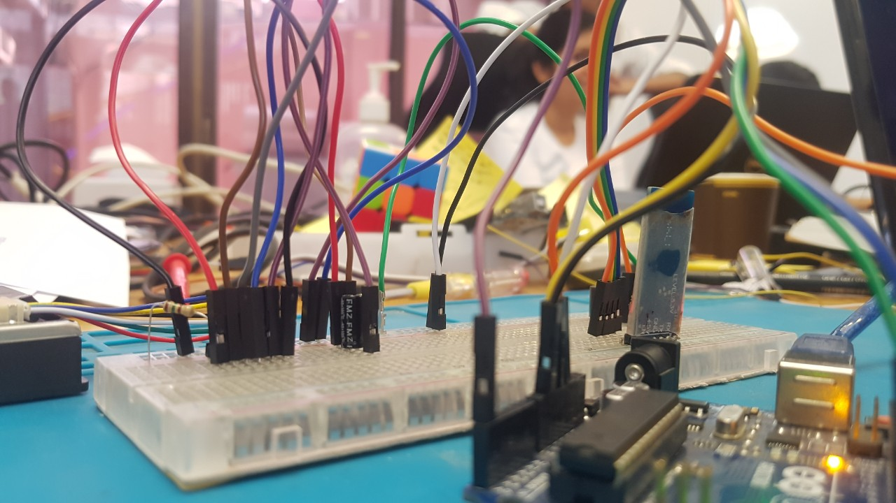
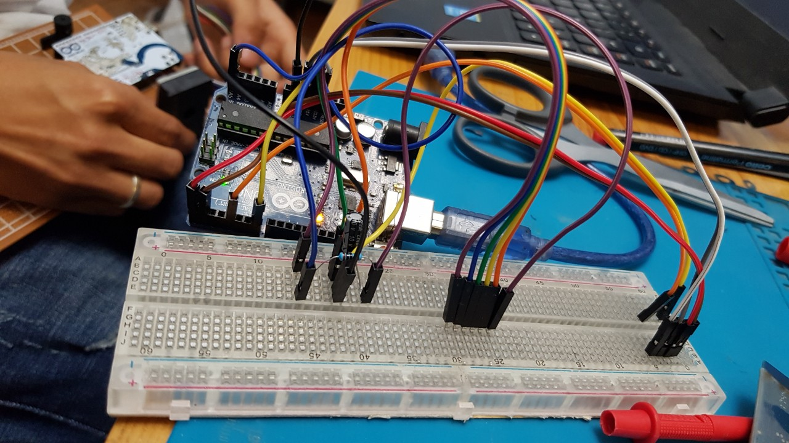
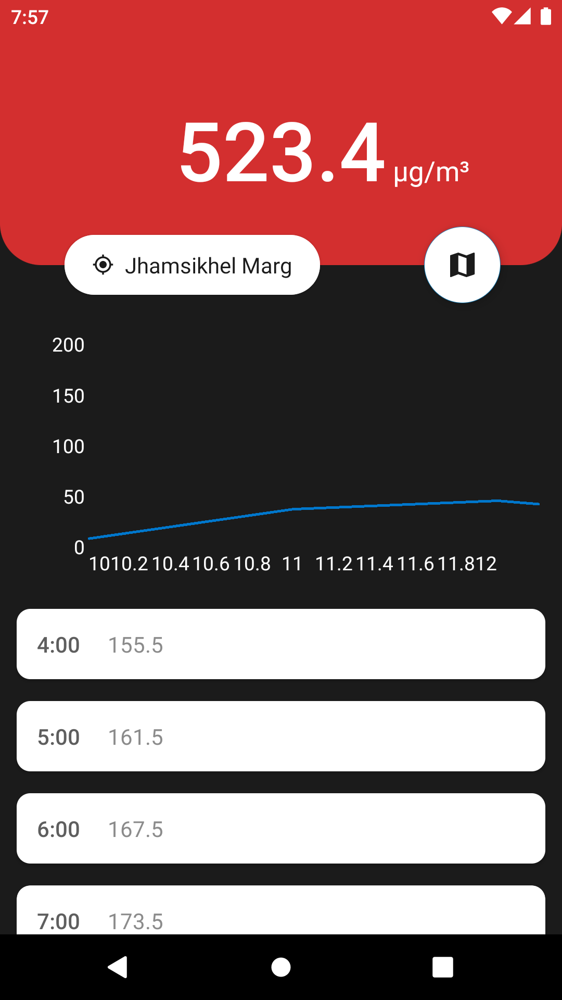

# PollutionMap

PollutionMap is an  Arduino based Air Quality Index (AQI) measurement device that can send AQI data to other devices via Bluetooth. It was developed during two days Hackathon organized by Bottle Technology. Arduino along with Dust Sensor Module - GP2Y1010AU0F and HC-05 Bluetooth Module is used in this project. Server and Client Android apps were also developed to upload and view the AQI data respectively. <a href="https://github.com/karunstha/PollutionMapUserApp"> UserApp source code </a>
## Images

**Hardware Device**

   

   

**Screenshot from UserApp**

   

## Components Used

1. Arduino Uno
2. Dust Sensor Module - GP2Y1010AU0F
3. HC-05 Bluetooth Module
4. Piezo Buzzer
5. Bread Board
6. Polar Capacitor 220 µF
7. Resistor 150 Ω

## Working

Dust Sensor Module - GP2Y1010AU0F was used for measuring concentration of dust particles in the air. As it was not a mobile device, Laptop itself was used as power source. Input from sensor (Voltage) was taken and converted to AQI mg/m3. This value was then send to AdminApp via bluetooth. AdminApp was used to upload the received data to the server. The uploaded data was then available to the users through UserApp. For bluetooth communication with Android device HC-05 Bluetooth Module was used. Arduino communicates with the Bluetooth module via serial communication and the module communicates with the Android device via Bluetooth.